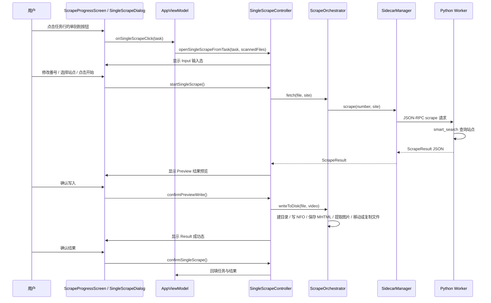
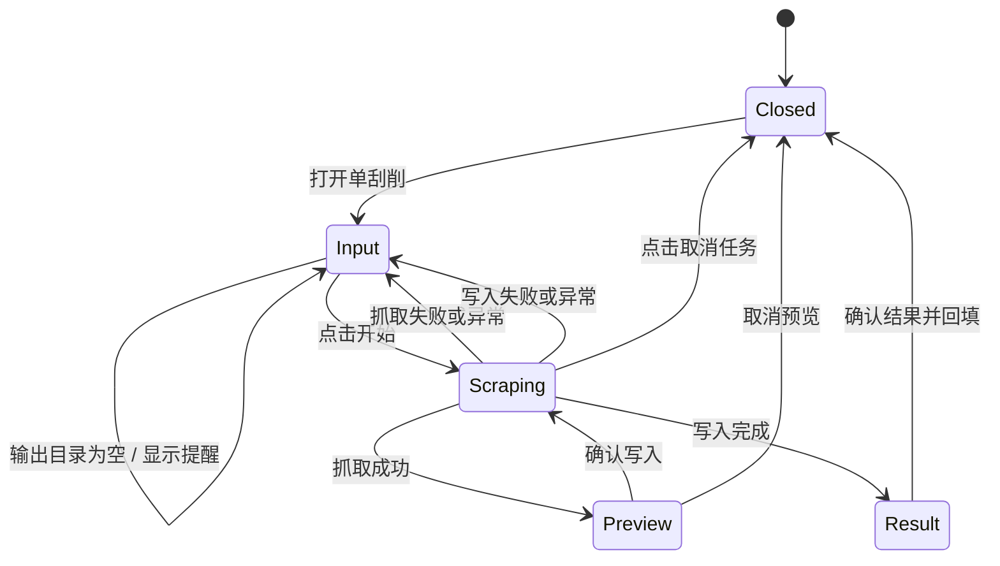

# 单文件刮削完整链路

## 文档范围

本文梳理“刮削进度页中对单个任务重新刮削”的完整链路，覆盖 Compose UI、状态机、Kotlin 编排、Sidecar JSON-RPC、Python worker、站点搜索、确认预览和磁盘写入。文档对应当前 `feature/codex` 分支实现。

相关入口：

- 进度页任务列表：`app/src/main/kotlin/javscraper/ui/screens/ScrapeProgressScreen.kt`
- 单刮削对话框：`app/src/main/kotlin/javscraper/ui/screens/SingleScrapeDialog.kt`
- 单刮削状态机：`app/src/main/kotlin/javscraper/SingleScrapeController.kt`
- 抓取与写入编排：`app/src/main/kotlin/javscraper/scrape/ScrapeOrchestrator.kt`
- 写入选项（设置投影）：`app/src/main/kotlin/javscraper/scrape/ScrapeOptions.kt`
- Worker JSON-RPC：`app/src/main/kotlin/javscraper/sidecar/SidecarManager.kt`
- Python RPC 入口：`scraper-worker/main.py`、`scraper-worker/ipc_handler.py`
- 站点搜索策略：`scraper-worker/core/smart_search.py`

## 总体链路



## 1. UI 入口与状态组装

1. `ScrapeProgressScreen` 是无状态纯组件，只接收 `ScrapeProgressState` 与 `ScrapeProgressActions`。
2. `AppViewModel` 负责把任务列表、单刮削状态、可用站点、输出目录和错误信息组装进 `ScrapeProgressState`。
3. 点击任务列表中的单刮削按钮后，UI 调用 `actions.onSingleScrapeClick(task)`。
4. `AppViewModel` 转发给 `SingleScrapeController.openSingleScrapeFromTask(task, scannedFiles)`：
   - 按 `number` 找回该任务下所有尚未刮削的 `ScannedFile`，保留多文件分组；
   - 找不到分组时，用任务中的 `path`、`fileName`、`number` 构造兜底 `ScannedFile`；
   - 打开对话框并进入 `Input` 状态。

站点下拉框的数据来源是 `AppViewModel.enabledSiteInfos`：先取 worker 返回的已注册站点，再按设置中的 `enabledSites` 过滤。因此显式可选站点与设置页的启用状态同步。

## 2. 单刮削状态机



### 状态定义

| 状态 | 含义 | 可执行操作 |
| --- | --- | --- |
| `Closed` | 对话框关闭 | 无 |
| `Input` | 输入番号、选择站点、查看错误 | 开始、关闭 |
| `Scraping` | 正在抓取，或用户已确认后正在写入 | 取消任务 |
| `Preview` | 抓取成功，等待用户确认是否写盘 | 确认写入、取消 |
| `Result` | 单次流程完成 | 确认并回填 |

`showMissingOutputDir` 是独立布尔状态。输出目录为空时，原 `Input` 对话框保留，同时叠加输出目录提醒对话框。

## 3. 启动前校验

点击“开始刮削”后，控制器依次检查：

1. 是否存在当前文件；
2. 番号是否为空；
3. 当前输出目录是否为空。

若输出目录为空，`startSingleScrape()` 不启动协程、不修改任务状态，只显示 `showMissingOutputDir` 提醒。输入对话框会显示当前输出目录；为空时显示占位提示。

校验通过后：

1. 清空上一次错误；
2. 对话框进入 `Scraping`；
3. 任务状态置为 `SCRAPING`；
4. 启动 `singleScrapeJob`；
5. 用输入框中的最新番号覆盖 `ScannedFile.number`，后续抓取与写盘都使用该值。

## 4. 元数据抓取阶段

此阶段只查询数据，不执行任何磁盘写入。

### Kotlin 侧

1. `SingleScrapeController` 调用 `ScrapeOrchestrator.fetchCandidates(sf, site)`。
2. `fetchCandidates` 校验番号非空。
3. `ScrapeOrchestrator` 调用 `SidecarManager.searchCandidates(number, site, enabledSites, siteMirrorUrls, downloadWebPages)`。
4. `SidecarManager` 会确保 worker 进程存活，发送 JSON-RPC `search` 方法，并等待响应。
5. 单个请求最多等待 60 秒；超时或异常会向上抛给单刮削控制器。

### Worker 与站点搜索

1. `scraper-worker/main.py` 以 UTF-8 读写 stdin、stdout、stderr，逐行读取 JSON-RPC 请求。
2. `ipc_handler.py` 将 `search` 路由到内部处理函数。
3. 处理函数调用候选搜索：指定站点时仅搜索该启用站点；未指定站点时先按内置优先级链排序，再仅尝试启用列表中的站点。请求会携带 `site_mirrors`，命中配置了镜像的站点时仅替换该请求实例的 `BASE_URL`。
4. 爬虫返回 `list[Video]` 后，worker 将全部候选转为 JSON 数组。
5. Kotlin 反序列化为 `List<Video>`。

### 下载网页设置

设置页的“下载网页”开启后，`ScrapeOrchestrator` 会在 `search` JSON-RPC 中附带 `save_webpage: true`。Worker 在 `BaseScraper` 层临时包装当前站点会话的 `get` 方法，记录最终命中详情页和后续子页面响应，再按 `Video.detail_url` 定位根页面。

归档过程只针对成功命中的详情页执行：Worker 解析根页面及 FC2 简介 iframe 等子 HTML 引用的图片、样式和脚本资源，使用同一会话抓取一次，生成标准 Multipart/Related MHTML，并把 Base64 内容放在 `Video.webpage` 字段返回。搜索页和未命中站点不会归档。MHTML 此时仅存在于内存和 RPC 响应中，不会在预览确认前写盘。
### 当前注意点

- “自动选择”会把设置中的 `enabledSites` 传给 worker；自动优先级链只会在启用站点中尝试。若所有可用优先级站点均未启用，worker 返回无数据。
- Worker 请求没有独立取消协议。UI 取消会取消 Kotlin 协程并关闭对话框，但 Python 端已开始的搜索可能继续执行，完成后响应会被忽略。

## 5. 抓取成功后的预览

抓取成功且返回至少一个候选后：

1. 控制器创建 `CompletableDeferred<Int?>`；
2. 状态切换为 `Preview(candidates)`，默认选中第一个候选；
3. 协程等待用户确认；
4. 对话框先展示候选列表，用户可切换选中项，并查看该候选的完整信息卡；
5. 此阶段不创建目录、不写 NFO、不写 MHTML、不保存图片、不复制或移动视频文件。

用户点击“确认写入”会 complete 当前选中索引，协程继续使用该候选进入写盘阶段。用户点击“取消”会 complete `null`，任务恢复 `PENDING`，对话框关闭，且不会执行任何 IO。

## 6. 确认后的磁盘写入

用户确认后，控制器重新进入 `Scraping`，并在 `Dispatchers.IO` 中调用 `ScrapeOrchestrator.writeToDisk(taskFiles, video)`。`taskFiles` 包含该番号分组下的全部待处理文件；`taskFiles` 为空时才回退到当前单文件。写入配置集中放在 `ScrapeOptions`（由 `AppSettings` 投影而来），设置变化时由 `WorkerController.rebuildOrchestrator()` 重建。

写入流程：

1. 按设置的目录层级模板生成目标文件夹；
2. `Files.createDirectories` 创建目标目录；
3. 写入 `.nfo` 文件；
4. 若开启“下载网页”，则将 `Video.webpage` 解码写入目标目录，文件名为安全化后的 `番号-站点.mhtml`；
5. 若开启“下载图片”：开启“下载网页”时，通过 `extract_webpage_images` RPC 只从 MHTML 提取封面和海报，不提取预览图；关闭“下载网页”时，封面和海报按 URL 下载。两条链路的图片落盘规则一致：封面（`Video.coverUrl`）保存为 `poster.jpg`，并复制同一份内容为 `fanart.jpg`（不单独下载 fanart）；独立海报地址（`Video.posterUrl`）当前所有刮削器均未填充，其覆盖下载分支实际不会触发。子选项“下载预览图”默认关闭，仅在父开关开启且自身开启时按网络 URL 下载 `sample_images`，即使已保存 MHTML 也不从归档提取；
6. 默认将源视频移动（剪切）到目标路径；
7. 关闭“移动原视频”时改为复制，保留源文件；
8. 若目标文件已存在，则跳过该文件；
9. 所有 IO 子操作均无错误时返回成功结果，单刮削进入 `Result`，任务状态置为 `SUCCESS`；任一子操作失败则聚合错误并返回失败。

### 更新模式

设置页“刮削”标签提供“更新模式”开关，默认关闭。该开关只影响单文件刮削确认写入后的 `writeSingleScrapeToDisk` 路径；批量刮削继续使用标准 `writeToDisk` 行为。

更新模式开启后：

1. 写盘前要求同一番号分组的源视频都在同一个旧文件夹中，且能定位到旧 NFO；否则返回聚合错误，不改写 NFO。
2. 仍按现有目录层级模板计算目标文件夹，但基准是设置中的扫描目录，而不是输出目录。目标与旧文件夹不一致时，将旧文件夹内所有条目逐个移动到扫描目录下的新文件夹，保留原文件名并删除空的旧文件夹；目标与旧文件夹一致时不移动。
3. 封面与预览图分开判断：旧文件夹已存在 `poster.jpg` 时复用该海报，
   不重新下载或提取封面，也不覆盖用户主动编辑后的结果；`fanart.jpg` 缺失时不触发封面下载。
4. NFO 不重新生成。`NfoUpdater` 只修改旧文件中已存在的受管字段，未知字段与旧文件中缺失的字段保持不动；新旧值一致时不写入文件。

### 多文件分组与 Jellyfin 多文件命名

扫描阶段会把常见 FC2 写法统一为同一个番号，例如以下文件都会归组到 `FC2-4694056`：

```text
FC2-4694056.mp4
FC2-4694056-2.mp4
FC2-4694056-3.mp4
FC2-PPV 4694056-4.mp4
```

写盘阶段检测到同一番号有多个文件时，会使用纯番号作为文件夹和视频文件的基础名，并复用同一套 Jellyfin 多文件规则：

1. 文件夹名与每个视频文件的基础名保持一致，统一使用番号，例如 `FC2-4694056`；
2. 无后缀或纯数字后缀会被识别为多分片，生成 `FC2-4694056 - part1.mp4`、`FC2-4694056 - part2.mp4`；
3. 原文件名已有 `-cd1`、`-cd2` 等分片标签时会原样保留；
4. `1080p`、`4K`、`Director's Cut` 等标签会被识别为多版本，生成 `FC2-4694056 - 1080p.mp4`、`FC2-4694056 - 4K.mp4`；
5. `-C`、`-c` 表示中文字幕，`-U`、`-u` 表示无码泄露；两者不参与番号识别，会在输出文件名末尾保留，并写入 `Video.version`，取值规范化为 `C`、`U` 或 `CU`；
6. NFO、图片和 MHTML 继续使用不带文件标签的基础名，与 Jellyfin 的共享元数据规则保持一致。

单文件刮削与批量刮削共用同一套写盘计划，因此从任务列表执行“单独刮削”时也会一次处理该番号下的全部文件。

### 当前注意点

`writeToDisk` 会聚合目录创建、NFO 写入、MHTML 写入、图片提取/下载和单个文件移动/复制异常。只要出现任一 IO 错误，结果会返回 `success=false` 与聚合错误信息，单刮削对话框回到 `Input` 并保留错误提示。注意：失败前已完成的子操作不会被自动回滚。

### 图片落盘规则

封面图片下载后不会产生独立的“fanart 下载”请求，fanart 是封面的副本：

| 输出文件 | 来源 | 说明 |
| --- | --- | --- |
| `poster.jpg` | `Video.coverUrl`（站点封面） | 唯一真实下载的封面图 |
| `fanart.jpg` | `poster.jpg` 的字节副本 | 复制自 poster，不做二次下载 |
| `extrafanart/fanartN.jpg` | `Video.sampleImages` | 仅在开启“下载预览图”时下载 |

- 网络直连链路（Kotlin `ImageSaver.download`）与 MHTML 提取链路（Python `core/webpage_archive.py` 的 `extract_images`）遵循相同规则，两条链路行为保持一致。
- `Video.posterUrl`（独立海报）目前所有刮削器均未填充，恒为空字符串；`ImageSaver.download` 中对应的覆盖下载分支为死代码，仅为未来某站点提供独立海报时保留。
- 因此每个刮削完成的影片目录实际得到内容相同的 `poster.jpg` + `fanart.jpg` 两份封面，这是有意为之的对齐 mdcx 惯例行为。

## 7. 结果确认与列表回填

写入成功后对话框展示 `Result`。用户点击确认：

1. `SingleScrapeController.confirmSingleScrape()` 取出任务和 `Video`；
2. 调用 `AppViewModel` 注册的 `onConfirmResult`；
3. 番号非空时按同源任务 upsert 到进度页任务列表；
4. 结果非空时按同番号 upsert 到结果列表；
5. 关闭对话框并清空单刮削临时任务。

回填使用 upsert 策略：任务优先按源路径识别，路径为空时按文件名识别；同源任务会被新状态替换，未知任务才追加。结果列表按番号替换，避免重复展示。输入框番号变化时，`singleScrapeTask.number` 会同步更新，因此抓取、写盘、展示与回填使用同一个新番号。

## 8. 失败与取消

### 失败

以下情况会把错误写入 `singleScrapeError`，任务置为 `FAILED`，对话框回到 `Input`：

- worker 未运行或编排器不可用；
- worker 返回 `success=false`；
- worker 响应超时或抛出异常；
- 写盘返回失败；
- 写盘阶段抛出异常。

失败后对话框不会自动关闭，用户可以看到错误并修改番号、站点后重试。

### 取消

取消行为按阶段区分：

| 阶段 | 用户操作 | 实际行为 |
| --- | --- | --- |
| `Input` | 点击关闭 | 清理临时文件与任务，关闭对话框 |
| `Scraping` | 点击取消任务 | 取消 Kotlin Job；`SCRAPING` 任务恢复 `PENDING`；关闭对话框 |
| `Preview` | 点击取消 | 拒绝写盘；任务恢复 `PENDING`；关闭对话框；不产生 IO |
| `Result` | 点击确认 | 回填任务和结果后关闭 |

注意：写盘阶段取消 Kotlin 协程后，已在执行的阻塞式 Java NIO 操作不一定能立即中断，可能继续完成当前文件操作。

## 9. 与批量刮削的关系

单文件刮削复用同一个 `ScrapeOrchestrator` 与 worker，但把流程拆成两个显式阶段：

- `fetch`：只取元数据；
- `writeToDisk`：只在用户确认预览后执行。

批量刮削仍通过 `processParts` 串行执行“抓取 + 写入”，没有单文件流程中的结果预览确认点。

## 10. 排查指引

| 现象 | 优先检查 |
| --- | --- |
| 点击开始立即提示 worker 未运行 | worker 路径、worker 进程启动日志、`SidecarManager.start()` |
| 返回中文乱码 | worker 是否包含 `main.py` 的 UTF-8 IO 修复；是否重新打包并部署 exe |
| 站点不可选或不符合设置 | 设置页启用状态、`enabledSites`、`AppViewModel.enabledSiteInfos` |
| 自动模式漏掉启用站点 | 检查设置 `enabledSites`、`ScrapeOptions.enabledSites` 与 RPC `sites` 参数 |
| 预览取消后仍出现文件 | 检查是否还有旧版本代码；当前取消分支在 `writeToDisk` 前返回 |
| 开启“下载网页”但没有 MHTML | 检查 worker 是否为新打包版本、`save_webpage` 请求参数和 `Video.webpage` 返回字段 |
| MHTML 存在但图片缺失 | 查看图片提取 RPC 错误，确认站点返回的图片 URL 已作为资源写入 MHTML |
| 对话框显示 IO 失败但目录中已有部分文件 | 当前失败不回滚已完成子操作；检查聚合错误信息和 worker/UI 日志 |
| 请求长时间无响应 | Sidecar 单请求 60 秒超时；结合 worker stderr、镜像网址设置与网络状况排查 |

## 11. 维护要求

1. 修改 Python worker 源码后，必须重新打包并部署 `scraper-worker.exe`。
2. 修改站点注册、优先级链或 RPC 字段时，同步更新相关 Kotlin 模型与测试。
3. 修改单刮削状态机时，保持“抓取成功先预览、确认后才 IO”的核心顺序。
4. 修改设置项时，确认 `WorkerController.rebuildOrchestrator()` 覆盖所有影响写盘的配置。
5. 新增 UI 文案时同步补齐所有语言实现。
