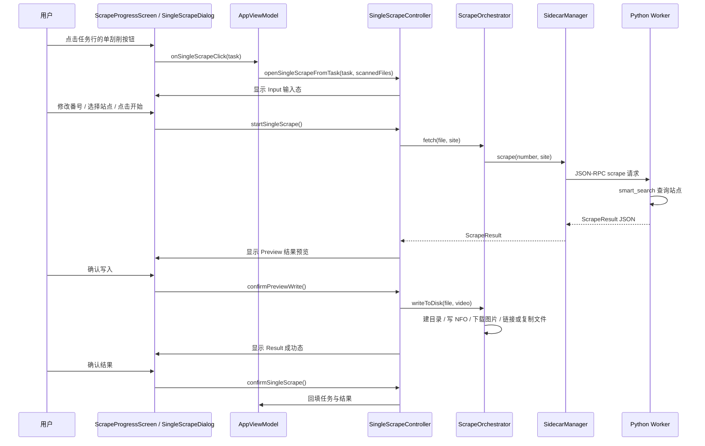
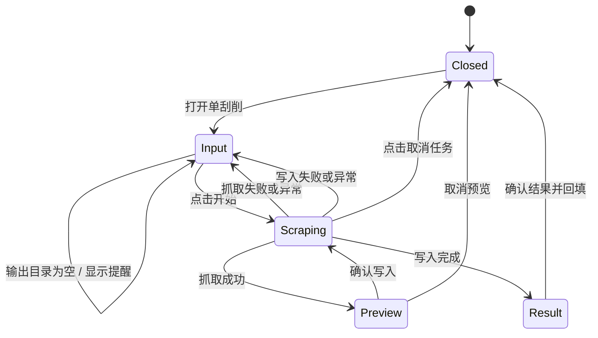

# 单文件刮削完整链路

## 文档范围

本文梳理“刮削进度页中对单个任务重新刮削”的完整链路，覆盖 Compose UI、状态机、Kotlin 编排、Sidecar JSON-RPC、Python worker、站点搜索、确认预览和磁盘写入。文档对应当前 `feature/codex` 分支实现。

相关入口：

- 进度页任务列表：`app/src/main/kotlin/javscraper/ui/screens/ScrapeProgressScreen.kt`
- 单刮削对话框：`app/src/main/kotlin/javscraper/ui/screens/SingleScrapeDialog.kt`
- 单刮削状态机：`app/src/main/kotlin/javscraper/SingleScrapeController.kt`
- 抓取与写入编排：`app/src/main/kotlin/javscraper/scrape/ScrapeOrchestrator.kt`
- Worker JSON-RPC：`app/src/main/kotlin/javscraper/sidecar/SidecarManager.kt`
- Python RPC 入口：`scraper-worker/main.py`、`scraper-worker/ipc_handler.py`
- 站点搜索策略：`scraper-worker/core/smart_search.py`

## 总体链路

## 1. UI 入口与状态组装

1. `ScrapeProgressScreen` 是无状态纯组件，只接收 `ScrapeProgressState` 与 `ScrapeProgressActions`。
2. `AppViewModel` 负责把任务列表、单刮削状态、可用站点、输出目录和错误信息组装进 `ScrapeProgressState`。
3. 点击任务列表中的单刮削按钮后，UI 调用 `actions.onSingleScrapeClick(task)`。
4. `AppViewModel` 转发给 `SingleScrapeController.openSingleScrapeFromTask(task, scannedFiles)`：
   - 优先按 `fileName` 从已扫描文件中找回原始 `ScannedFile`；
   - 找不到时，用任务中的 `path`、`fileName`、`number` 构造兜底 `ScannedFile`；
   - 打开对话框并进入 `Input` 状态。

站点下拉框的数据来源是 `AppViewModel.enabledSiteInfos`：先取 worker 返回的已注册站点，再按设置中的 `enabledSites` 过滤。因此显式可选站点与设置页的启用状态同步。

## 2. 单刮削状态机

### 状态定义

| 状态 | 含义 | 可执行操作 |
| --- | --- | --- |
| `Closed` | 对话框关闭 | 无 |
| `Input` | 输入番号、选择站点、查看错误 | 开始、关闭 |
| `Scraping` | 正在抓取，或用户已确认后正在写入 | 取消任务 |
| `Preview` | 抓取成功，等待用户确认是否写盘 | 确认写入、取消 |
| `Result` | 单次流程完成 | 确认并回填 |

`showMissingOutputDir` 是独立布尔状态。输出目录为空时，原 `Input` 对话框保留，同时叠加输出目录提醒对话框。

## 3. 启动前校验

点击“开始刮削”后，控制器依次检查：

1. 是否存在当前文件；
2. 番号是否为空；
3. 当前输出目录是否为空。

若输出目录为空，`startSingleScrape()` 不启动协程、不修改任务状态，只显示 `showMissingOutputDir` 提醒。输入对话框会显示当前输出目录；为空时显示占位提示。

校验通过后：

1. 清空上一次错误；
2. 对话框进入 `Scraping`；
3. 任务状态置为 `SCRAPING`；
4. 启动 `singleScrapeJob`；
5. 用输入框中的最新番号覆盖 `ScannedFile.number`，后续抓取与写盘都使用该值。

## 4. 元数据抓取阶段

此阶段只查询数据，不执行任何磁盘写入。

### Kotlin 侧

1. `SingleScrapeController` 调用 `ScrapeOrchestrator.fetch(sf, site)`。
2. `fetch` 校验番号非空。
3. `ScrapeOrchestrator` 调用 `SidecarManager.scrape(number, site)`。
4. `SidecarManager` 会确保 worker 进程存活，发送 JSON-RPC `scrape` 方法，并等待响应。
5. 单个请求最多等待 60 秒；超时或异常会向上抛给单刮削控制器。

### Worker 与站点搜索

1. `scraper-worker/main.py` 以 UTF-8 读写 stdin、stdout、stderr，逐行读取 JSON-RPC 请求。
2. `ipc_handler.py` 将 `scrape` 路由到内部处理函数。
3. 处理函数调用 smart_search(number, site, enabled_sites)：
   - 指定站点时，要求该站点存在于注册表且位于启用列表中；
   - 未指定站点时，先按内置优先级链排序，再仅尝试启用列表中的站点。
4. 爬虫返回 `Video` 后，worker 转成 `{"success": true, "data": ...}`。
5. Kotlin 反序列化为 `ScrapeResult`。

### 当前注意点

- “自动选择”会把设置中的 `enabledSites` 传给 worker；自动优先级链只会在启用站点中尝试。若所有可用优先级站点均未启用，worker 返回无数据。
- Worker 请求没有独立取消协议。UI 取消会取消 Kotlin 协程并关闭对话框，但 Python 端已开始的搜索可能继续执行，完成后响应会被忽略。

## 5. 抓取成功后的预览

抓取成功且返回 `Video` 后：

1. 控制器创建 `CompletableDeferred<Boolean>`；
2. 状态切换为 `Preview(video)`；
3. 协程等待用户选择；
4. 对话框展示番号、标题、演员、来源、日期等关键字段；
5. 此阶段不创建目录、不写 NFO、不下载图片、不复制或链接视频文件。

用户点击“确认写入”会 complete `true`，协程继续进入写盘阶段。用户点击“取消”会 complete `false`，任务恢复 `PENDING`，对话框关闭，且不会执行任何 IO。

## 6. 确认后的磁盘写入

用户确认后，控制器重新进入 `Scraping`，并在 `Dispatchers.IO` 中调用 `ScrapeOrchestrator.writeToDisk(listOf(file), video)`。写入配置来自当前 `ScrapeOrchestrator`，设置变化时由 `WorkerController.rebuildOrchestrator()` 重建。

写入流程：

1. 按设置的目录层级模板生成目标文件夹；
2. `Files.createDirectories` 创建目标目录；
3. 写入 `.nfo` 文件；
4. 若开启图片下载，则下载封面、海报和剧照；
5. 对源视频执行硬链接；硬链接失败时回退为复制；
6. 若开启“复制而非硬链接”，则直接复制；
7. 若目标文件已存在，则跳过该文件；
8. 所有 IO 子操作均无错误时返回成功结果，单刮削进入 `Result`，任务状态置为 `SUCCESS`；任一子操作失败则聚合错误并返回失败。

### 当前注意点

`writeToDisk` 会聚合目录创建、NFO 写入、图片下载和单个文件链接/复制异常。只要出现任一 IO 错误，结果会返回 `success=false` 与聚合错误信息，单刮削对话框回到 `Input` 并保留错误提示。注意：失败前已完成的子操作不会被自动回滚。

## 7. 结果确认与列表回填

写入成功后对话框展示 `Result`。用户点击确认：

1. `SingleScrapeController.confirmSingleScrape()` 取出任务和 `Video`；
2. 调用 `AppViewModel` 注册的 `onConfirmResult`；
3. 番号非空时按同源任务 upsert 到进度页任务列表；
4. 结果非空时按同番号 upsert 到结果列表；
5. 关闭对话框并清空单刮削临时任务。

回填使用 upsert 策略：任务优先按源路径识别，路径为空时按文件名识别；同源任务会被新状态替换，未知任务才追加。结果列表按番号替换，避免重复展示。输入框番号变化时，`singleScrapeTask.number` 会同步更新，因此抓取、写盘、展示与回填使用同一个新番号。

## 8. 失败与取消

### 失败

以下情况会把错误写入 `singleScrapeError`，任务置为 `FAILED`，对话框回到 `Input`：

- worker 未运行或编排器不可用；
- worker 返回 `success=false`；
- worker 响应超时或抛出异常；
- 写盘返回失败；
- 写盘阶段抛出异常。

失败后对话框不会自动关闭，用户可以看到错误并修改番号、站点后重试。

### 取消

取消行为按阶段区分：

| 阶段 | 用户操作 | 实际行为 |
| --- | --- | --- |
| `Input` | 点击关闭 | 清理临时文件与任务，关闭对话框 |
| `Scraping` | 点击取消任务 | 取消 Kotlin Job；`SCRAPING` 任务恢复 `PENDING`；关闭对话框 |
| `Preview` | 点击取消 | 拒绝写盘；任务恢复 `PENDING`；关闭对话框；不产生 IO |
| `Result` | 点击确认 | 回填任务和结果后关闭 |

注意：写盘阶段取消 Kotlin 协程后，已在执行的阻塞式 Java NIO 操作不一定能立即中断，可能继续完成当前文件操作。

## 9. 与批量刮削的关系

单文件刮削复用同一个 `ScrapeOrchestrator` 与 worker，但把流程拆成两个显式阶段：

- `fetch`：只取元数据；
- `writeToDisk`：只在用户确认预览后执行。

批量刮削仍通过 `processParts` 串行执行“抓取 + 写入”，没有单文件流程中的结果预览确认点。

## 10. 排查指引

| 现象 | 优先检查 |
| --- | --- |
| 点击开始立即提示 worker 未运行 | worker 路径、worker 进程启动日志、`SidecarManager.start()` |
| 返回中文乱码 | worker 是否包含 `main.py` 的 UTF-8 IO 修复；是否重新打包并部署 exe |
| 站点不可选或不符合设置 | 设置页启用状态、`enabledSites`、`AppViewModel.enabledSiteInfos` |
| 自动模式漏掉启用站点 | 检查设置 `enabledSites`、`ScrapeOrchestrator.enabledSites` 与 RPC `sites` 参数 |
| 预览取消后仍出现文件 | 检查是否还有旧版本代码；当前取消分支在 `writeToDisk` 前返回 |
| 对话框显示 IO 失败但目录中已有部分文件 | 当前失败不回滚已完成子操作；检查聚合错误信息和 worker/UI 日志 |
| 请求长时间无响应 | Sidecar 单请求 60 秒超时；结合 worker stderr 与网络状况排查 |

## 11. 维护要求

1. 修改 Python worker 源码后，必须重新打包并部署 `scraper-worker.exe`。
2. 修改站点注册、优先级链或 RPC 字段时，同步更新相关 Kotlin 模型与测试。
3. 修改单刮削状态机时，保持“抓取成功先预览、确认后才 IO”的核心顺序。
4. 修改设置项时，确认 `WorkerController.rebuildOrchestrator()` 覆盖所有影响写盘的配置。
5. 新增 UI 文案时同步补齐所有语言实现。
